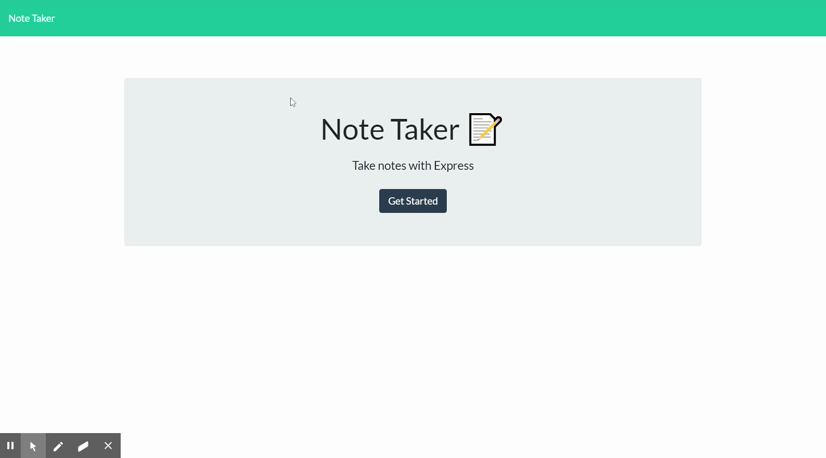

# Note Taker

## Description

Note Taker is an app that can be used to write and save notes. This application will use an Express.js back end and will save and retrieve note data from a JSON file.

## Table of Contents

- [Installation](#installation)
- [Usage](#usage)
- [Credits](#credits)
- [License](#license)
- [Contributing](#contributing)
- [Tests](#tests)
- [Questions](#questions)

## Installation

Clone the Repo, install express (npm install express), & insure package.json is present (npm init). Once the node modules & package.json are created you can move on to usage. If nodemon isn't installed, please install that as well (npm install nodemon -g).

## Usage

Once installed run the applicaiton by opening the terminal and entering: nodemon server.js

When on the localhost page click get started and you may begin writing notes.

[Deployed Heroku App](https://mikefogz-notetaker.herokuapp.com/)



## Contributing

This project is open to collaboration.

## Credits

List of contirbutors I worked with and tools/tutorials used on this project:

## License

MIT

MIT License

Copyright (c) [2020] [Mike Fogarty]

Permission is hereby granted, free of charge, to any person obtaining a copy
of this software and associated documentation files (the "Software"), to deal
in the Software without restriction, including without limitation the rights
to use, copy, modify, merge, publish, distribute, sublicense, and/or sell
copies of the Software, and to permit persons to whom the Software is
furnished to do so, subject to the following conditions:

The above copyright notice and this permission notice shall be included in all
copies or substantial portions of the Software.

THE SOFTWARE IS PROVIDED "AS IS", WITHOUT WARRANTY OF ANY KIND, EXPRESS OR
IMPLIED, INCLUDING BUT NOT LIMITED TO THE WARRANTIES OF MERCHANTABILITY,
FITNESS FOR A PARTICULAR PURPOSE AND NONINFRINGEMENT. IN NO EVENT SHALL THE
AUTHORS OR COPYRIGHT HOLDERS BE LIABLE FOR ANY CLAIM, DAMAGES OR OTHER
LIABILITY, WHETHER IN AN ACTION OF CONTRACT, TORT OR OTHERWISE, ARISING FROM,
OUT OF OR IN CONNECTION WITH THE SOFTWARE OR THE USE OR OTHER DEALINGS IN THE
SOFTWARE.

## Questions

You can find me on GitHub [@MikeFogz](https://github.com/MikeFogz)

I can be contacted at MikeFogz@gmail.com

## Acceptance Criteria

```
GIVEN a note-taking application
WHEN I open the Note Taker
THEN I am presented with a landing page with a link to a notes page
WHEN I click on the link to the notes page
THEN I am presented with a page with existing notes listed in the left-hand column (GET request here), plus empty fields to enter a new note title and the note’s text in the right-hand column (Form to enter new code. Look at SW app.)
WHEN I enter a new note title and the note’s text
THEN a Save icon appears in the navigation at the top of the page (IF text value = "" no icon, once value icon appears. "Conditional Values")
WHEN I click on the Save icon (POST request send in text data, text needs to be saved. Take text data look at "router.post("/characters/new",) on api-routes in starwars)
THEN the new note I have entered is saved and appears in the left-hand column with the other existing notes
WHEN I click on an existing note in the list in the left-hand column
THEN that note appears in the right-hand column (*append)
WHEN I click on the Write icon in the navigation at the top of the page
THEN I am presented with empty fields to enter a new note title and the note’s text in the right-hand column
```
